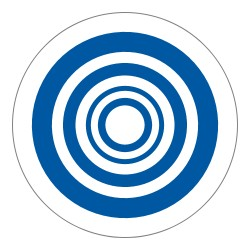
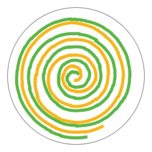
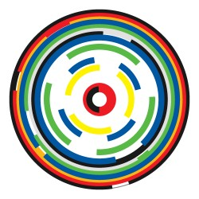
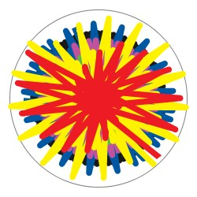
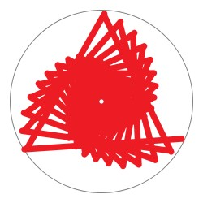
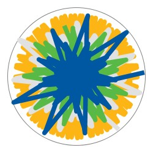
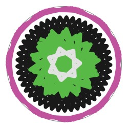
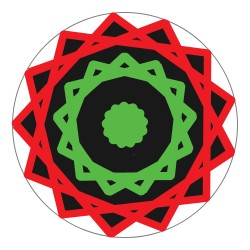

# Pottery wheel

Inspired by: [https://www.instagram.com/p/BXGazasHcuW/](https://www.instagram.com/p/BXGazasHcuW/)

Demo (live): [https://balazsdavid987.github.io/Pottery-Wheel/](https://balazsdavid987.github.io/Pottery-Wheel/)

Demo (video): [https://www.youtube.com/watch?v=vAK1gZO2iq8](https://www.youtube.com/watch?v=vAK1gZO2iq8) 

## Examples

*Note: due to a bug, you can draw polygons instead of circles when the wheel is spinning fast and I like that so much that I decided to leave it unfixed.*

